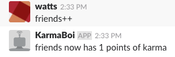
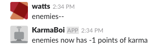
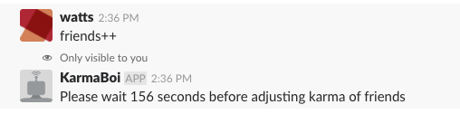
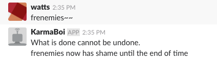
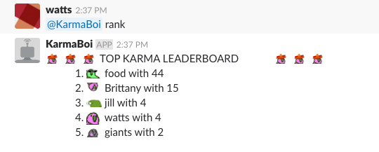
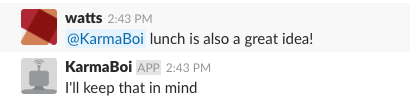
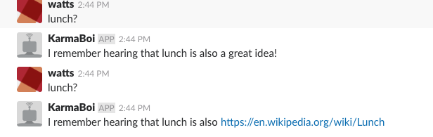

KarmaBoi
========

A bot which connects to slack to track karma! Grows a work community by tracking internet points persistently for users

Requirements and installation
-----------------------------

First off, KarmaBoi needs a `bot name and token <https://api.slack.com/bot-users>`_ provided as environment variables.

To deploy to cloud foundry, be sure a postgres sql instance is available and the service name is set correctly in ``dbopts.py``, set user provided environment variables for ``SLACK_BOT_TOKEN`` and ``SLACK_BOT_NAME`` then push the app:

.. code-block:: bash

    cf push KarmaBoi
    
The database tables will be configured automatically as long as a valid db instance is available.

Edit the `command` line of the ``manifest.yml`` to change the startup command.

KarmaBoi requires Python 3 and `PyPI <https://pypi.python.org/pypi>`_ to be installed locally. 

The default home location is ``~/.KarmaBoi``, and the database and logs will be placed there by default. Likewise, a ``bot_token`` file needs to be created in the home directory, in the following format::

    name:My-Bot-Name
    token:xoxb-My-Token

Just source the init.sh file and all requirements will be installed automatically.

.. code-block:: bash

    source init.sh
    

KarmaBoi will run happily on Linux or MacOS. As the app runs persistently, it is recommended to use ``nohup`` and background the app using ``&`` to ensure that a lost terminal session doesn't kill the app.

.. code-block:: bash

    nohup ./KarmaBoi/KarmaBoi.py&
    

Basic Usage
-----------

You can give any user or name karma by adding '++' to the end of the word:

Subtracting karma is just as simple - simply add '--':

The bot uses user IDs, so if a user's display name changes, their karma will remain.

There's a timer to prevent vote spam - karma can't be added or subtracked during this time:

You can also give name shame. Be intentional - shame cannot be decreased, it stays for the life of the user!

You can see full leaderboards by messaging the bot and give it one of the following commands: rank (for highest karma leaderboard), !rank (for lowest karma leaderboard), or ~rank (for shame leaderboard):

The bot also has a memory feature - you can tag any word using the keyword "is also":

and display what is remembered with the "keyword + ?". If a keyword has multiple inputs, the bot will choose a random one to display:

Additional information
----------------------

Submit an issue or for any questions. I welcome contributions via pull requests as well.

Please check out new development of the bot in Golang:
https://github.com/Tylarb/KarmaBoi-Go

License
*******

Released under MIT license, copyright 2018 Tyler Ramer
